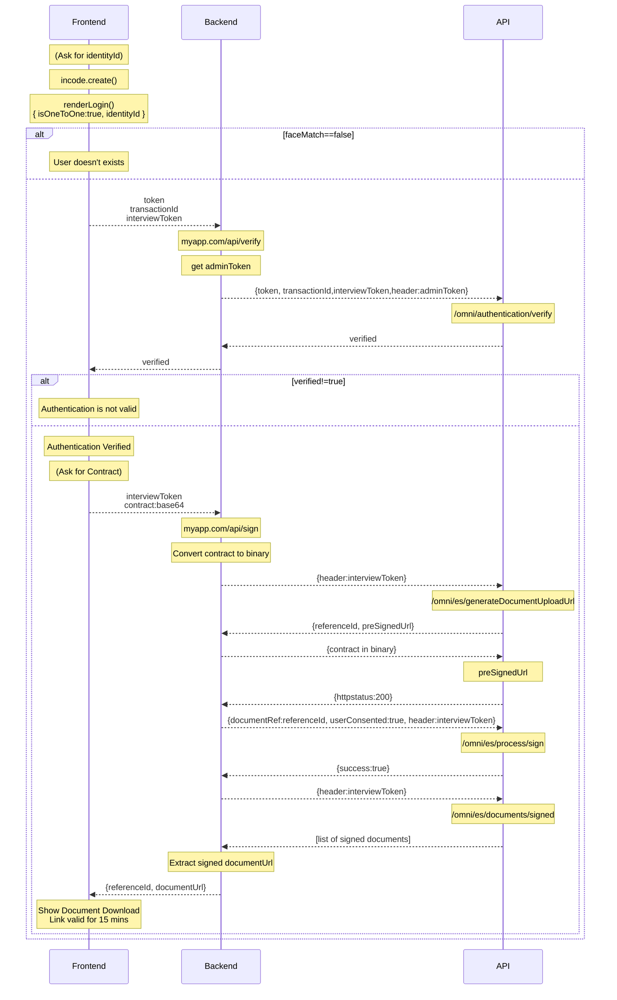

# Face Authentication + Signature Sample

This sample follows the next steps to go trough the Face Authentication
and then signing of a contract.



## Install
This project has two subfolders, one for `frontend` and one for `backend`.

to install them  do `npm install`in both folders.

## Configure
Inside both folder you will find a `.env.example` file, copy it as `.env` and
fill the relevant variables inside it.

## Running
You need to run both the backend and the frontend at the same time.

Frontend
```
npm run dev
```

Backend
```
npm run nodemon
```

Your computer will then present a webpage in `https://your-local-ip:5731/` where
you can authenticate and sign, a `small-sample-contract.pdf` is included with the
project for that.

A fake backend is included it's locally exposed in `http://localhost:3000/`and
reverse proxyed into `https://your-local-ip:5731/api` for CORS compatibility.

## Admin Token
For the verify actio nyou need an Admin Token, that get via an executive user-password
and have a 24 hour expiration, thus need a more involved strategy to be generated,
renewed, securely saved and shared to the app.

For this simple test just use the following cURl, and add save the generated token to
the `backend/.env` file, you will need to refresh it after 24 hours.

```bash
curl --location 'https://demo-api.incodesmile.com/executive/log-in' \
--header 'Content-Type: application/json' \
--header 'api-version: 1.0' \
--header 'x-api-key: <your-apikey>' \
--data '{
    "email": "••••••",
    "password": "••••••"
}'
```

## Important

The URL for the API Url is different in frontend than in backend, frontend uses
the `0/` at the end.

## Dependencies

* **nodejs18+**: JavaScript runtime built on Chrome's V8 JavaScript engine.
* **express**: Web server framework.
* **dotenv**: Used to access environment variables.